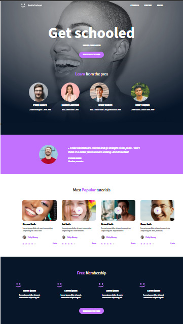
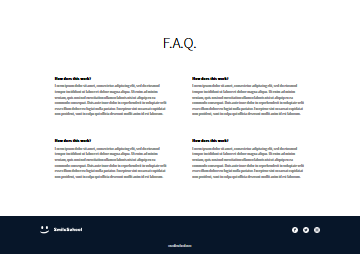

# SmileSchool Landing Page 😃

This is a modern and fully responsive landing page for SmileSchool, created with pure HTML and CSS. The project was built based on a detailed Figma design to create a pixel-perfect, user-friendly interface.

**🎨 Figma Design:** [View the design file](https://www.figma.com/design/dyYL6Ku4WG7vsdpwvlcJZC/Homepage?node-id=0-1&p=f&t=xbddRXMhkdUb5r8m-0)

## ✨ Features

- **Hero Section:** A welcoming banner with a strong call-to-action.
- **Pros Section:** Featuring the top professionals.
- **Testimonial:** A glowing review from a happy user.
- **Popular Tutorials:** A card-based layout showcasing video tutorials.
- **Free Membership:** A section encouraging users to sign up.
- **F.A.Q.:** Answering the most common questions.
- **Responsive Footer:** With social media links and copyright info.

## 💻 Tech Stack

- HTML5
- CSS3

## 🚀 How to Use

1.  Clone the repository or download the files.
2.  Navigate to the `css_advanced` directory.
3.  Open the `index.html` file in your favorite web browser.

And that's it! Enjoy the smiles. 😊
